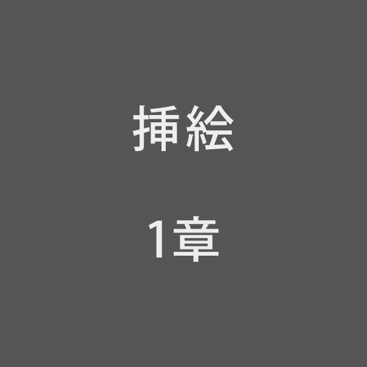

# 一、{午后|ごご}の授業

「ではみなさんは、そういうふうに川だと{云|い}われたり、乳の流れたあとだと云われたりしていたこのぼんやりと白いものがほんとうは何かご承知ですか。」先生は、黒板に{吊|つる}した大きな黒い星座の図の、上から下へ白くけぶった銀河帯のようなところを{指|さ}しながら、みんなに{問|とい}をかけました。
　カムパネルラが手をあげました。それから四五人手をあげました。ジョバンニも手をあげようとして、急いでそのままやめました。たしかにあれがみんな星だと、いつか雑誌で読んだのでしたが、このごろはジョバンニはまるで毎日教室でもねむく、本を読むひまも読む本もないので、なんだかどんなこともよくわからないという気持ちがするのでした。
　ところが先生は早くもそれを{見附|みつ}けたのでした。
「ジョバンニさん。あなたはわかっているのでしょう。」
　ジョバンニは{勢|いきおい}よく立ちあがりましたが、立って見るともうはっきりとそれを答えることができないのでした。ザネリが前の席からふりかえって、ジョバンニを見てくすっとわらいました。ジョバンニはもうどぎまぎしてまっ赤になってしまいました。先生がまた云いました。
「大きな望遠鏡で銀河をよっく調べると銀河は大体何でしょう。」
　やっぱり星だとジョバンニは思いましたがこんどもすぐに答えることができませんでした。
　先生はしばらく困ったようすでしたが、{眼|め}をカムパネルラの方へ向けて、
「ではカムパネルラさん。」と名指しました。するとあんなに元気に手をあげたカムパネルラが、やはりもじもじ立ち上ったままやはり答えができませんでした。
　先生は意外なようにしばらくじっとカムパネルラを見ていましたが、急いで「では。よし。」と云いながら、自分で星図を{指|さ}しました。
「このぼんやりと白い銀河を大きないい望遠鏡で見ますと、もうたくさんの小さな星に見えるのです。ジョバンニさんそうでしょう。」
　ジョバンニはまっ赤になってうなずきました。けれどもいつかジョバンニの眼のなかには{涙|なみだ}がいっぱいになりました。そうだ{僕|ぼく}は知っていたのだ、{勿論|もちろん}カムパネルラも知っている、それはいつかカムパネルラのお父さんの博士のうちでカムパネルラといっしょに読んだ雑誌のなかにあったのだ。それどこでなくカムパネルラは、その雑誌を読むと、すぐお父さんの{書斎|しょさい}から{巨|おお}きな本をもってきて、ぎんがというところをひろげ、まっ黒な{頁|ページ}いっぱいに白い点々のある美しい写真を二人でいつまでも見たのでした。それをカムパネルラが忘れる{筈|はず}もなかったのに、すぐに返事をしなかったのは、このごろぼくが、朝にも午后にも仕事がつらく、学校に出てももうみんなともはきはき遊ばず、カムパネルラともあんまり物を云わないようになったので、カムパネルラがそれを知って気の毒がってわざと返事をしなかったのだ、そう考えるとたまらないほど、じぶんもカムパネルラもあわれなような気がするのでした。
　先生はまた云いました。
「ですからもしもこの{天|あま}の{川|がわ}がほんとうに川だと考えるなら、その一つ一つの小さな星はみんなその川のそこの砂や{砂利|じゃり}の{粒|つぶ}にもあたるわけです。またこれを巨きな乳の流れと考えるならもっと天の川とよく似ています。つまりその星はみな、乳のなかにまるで細かにうかんでいる{脂油|しゆ}の球にもあたるのです。そんなら何がその川の水にあたるかと云いますと、それは真空という光をある速さで伝えるもので、太陽や地球もやっぱりそのなかに{浮|うか}んでいるのです。つまりは私どもも天の川の水のなかに{棲|す}んでいるわけです。そしてその天の川の水のなかから四方を見ると、ちょうど水が深いほど青く見えるように、天の川の底の深く遠いところほど星がたくさん集って見えしたがって白くぼんやり見えるのです。この模型をごらんなさい。」
　先生は中にたくさん光る砂のつぶの入った大きな両面の{凸|とつ}レンズを指しました。
「天の川の形はちょうどこんななのです。このいちいちの光るつぶがみんな私どもの太陽と同じようにじぶんで光っている星だと考えます。私どもの太陽がこのほぼ中ごろにあって地球がそのすぐ近くにあるとします。みなさんは夜にこのまん中に立ってこのレンズの中を見まわすとしてごらんなさい。こっちの方はレンズが{薄|うす}いのでわずかの光る粒{即|すなわ}ち星しか見えないのでしょう。こっちやこっちの方はガラスが厚いので、光る粒即ち星がたくさん見えその遠いのはぼうっと白く見えるというこれがつまり今日の銀河の説なのです。そんならこのレンズの大きさがどれ位あるかまたその中のさまざまの星についてはもう時間ですからこの次の理科の時間にお話します。では今日はその銀河のお祭なのですからみなさんは外へでてよくそらをごらんなさい。ではここまでです。本やノートをおしまいなさい。」
　そして教室中はしばらく{机|つくえ}の{蓋|ふた}をあけたりしめたり本を重ねたりする音がいっぱいでしたがまもなくみんなはきちんと立って礼をすると教室を出ました。

