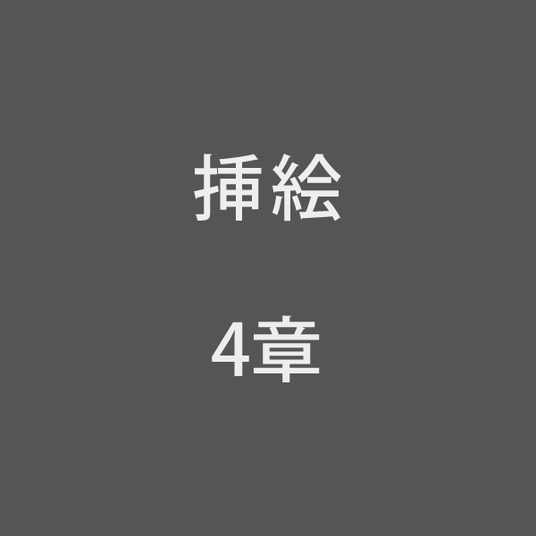

［＃３字下げ］四、ケンタウル祭の夜［＃「四、ケンタウル祭の夜」は中見出し］

　ジョバンニは、口笛を吹いているようなさびしい口付きで、檜《ひのき》のまっ黒にならんだ町の坂を下りて来たのでした。
　坂の下に大きな一つの街燈が、青白く立派に光って立っていました。ジョバンニが、どんどん電燈の方へ下りて行きますと、いままでばけもののように、長くぼんやり、うしろへ引いていたジョバンニの影《かげ》ぼうしは、だんだん濃《こ》く黒くはっきりなって、足をあげたり手を振《ふ》ったり、ジョバンニの横の方へまわって来るのでした。
（ぼくは立派な機関車だ。ここは勾配《こうばい》だから速いぞ。ぼくはいまその電燈を通り越《こ》す。そうら、こんどはぼくの影法師はコムパスだ。あんなにくるっとまわって、前の方へ来た。）

とジョバンニが思いながら、大股《おおまた》にその街燈の下を通り過ぎたとき、いきなりひるまのザネリが、新らしいえりの尖《とが》ったシャツを着て電燈の向う側の暗い小路《こうじ》から出て来て、ひらっとジョバンニとすれちがいました。
「ザネリ、烏瓜ながしに行くの。」ジョバンニがまだそう云ってしまわないうちに、
「ジョバンニ、お父さんから、らっこの上着が来るよ。」その子が投げつけるようにうしろから叫《さけ》びました。
　ジョバンニは、ばっと胸がつめたくなり、そこら中きぃんと鳴るように思いました。
「何だい。ザネリ。」とジョバンニは高く叫び返しましたがもうザネリは向うのひばの植った家の中へはいっていました。
「ザネリはどうしてぼくがなんにもしないのにあんなことを云うのだろう。走るときはまるで鼠《ねずみ》のようなくせに。ぼくがなんにもしないのにあんなことを云うのはザネリがばかなからだ。」
　ジョバンニは、せわしくいろいろのことを考えながら、さまざまの灯《あかり》や木の枝《えだ》で、すっかりきれいに飾《かざ》られた街を通って行きました。時計屋の店には明るくネオン燈がついて、一秒ごとに石でこさえたふくろうの赤い眼《め》が、くるっくるっとうごいたり、いろいろな宝石が海のような色をした厚い硝子《ガラス》の盤《ばん》に載《の》って星のようにゆっくり循《めぐ》ったり、また向う側から、銅の人馬がゆっくりこっちへまわって来たりするのでした。そのまん中に円い黒い星座早見が青いアスパラガスの葉で飾ってありました。
　ジョバンニはわれを忘れて、その星座の図に見入りました。
　それはひる学校で見たあの図よりはずうっと小さかったのですがその日と時間に合せて盤をまわすと、そのとき出ているそらがそのまま楕円形《だえんけい》のなかにめぐってあらわれるようになって居《お》りやはりそのまん中には上から下へかけて銀河がぼうとけむったような帯になってその下の方ではかすかに爆発《ばくはつ》して湯気でもあげているように見えるのでした。またそのうしろには三本の脚《あし》のついた小さな望遠鏡が黄いろに光って立っていましたしいちばんうしろの壁《かべ》には空じゅうの星座をふしぎな獣《けもの》や蛇《へび》や魚や瓶《びん》の形に書いた大きな図がかかっていました。ほんとうにこんなような蝎《さそり》だの勇士だのそらにぎっしり居るだろうか、ああぼくはその中をどこまでも歩いて見たいと思ってたりしてしばらくぼんやり立って居ました。
　それから俄《にわ》かにお母さんの牛乳のことを思いだしてジョバンニはその店をはなれました。そしてきゅうくつな上着の肩《かた》を気にしながらそれでもわざと胸を張って大きく手を振って町を通って行きました。
　空気は澄《す》みきって、まるで水のように通りや店の中を流れましたし、街燈はみなまっ青なもみや楢《なら》の枝で包まれ、電気会社の前の六本のプラタヌスの木などは、中に沢山《たくさん》の豆電燈がついて、ほんとうにそこらは人魚の都のように見えるのでした。子どもらは、みんな新らしい折のついた着物を着て、星めぐりの口笛《くちぶえ》を吹《ふ》いたり、
「ケンタウルス、露《つゆ》をふらせ。」と叫んで走ったり、青いマグネシヤの花火を燃したりして、たのしそうに遊んでいるのでした。けれどもジョバンニは、いつかまた深く首を垂れて、そこらのにぎやかさとはまるでちがったことを考えながら、牛乳屋の方へ急ぐのでした。
　ジョバンニは、いつか町はずれのポプラの木が幾本《いくほん》も幾本も、高く星ぞらに浮《うか》んでいるところに来ていました。その牛乳屋の黒い門を入り、牛の匂《におい》のするうすくらい台所の前に立って、ジョバンニは帽子《ぼうし》をぬいで「今晩は、」と云いましたら、家の中はしぃんとして誰《たれ》も居たようではありませんでした。
「今晩は、ごめんなさい。」ジョバンニはまっすぐに立ってまた叫びました。するとしばらくたってから、年｜老《と》った女の人が、どこか工合《ぐあい》が悪いようにそろそろと出て来て何か用かと口の中で云いました。
「あの、今日、牛乳が僕《ぼく》※［＃小書き平仮名ん、168-12］とこへ来なかったので、貰《もら》いにあがったんです。」ジョバンニが一生けん命｜勢《いきおい》よく云いました。
「いま誰もいないでわかりません。あしたにして下さい。」
　その人は、赤い眼の下のとこを擦《こす》りながら、ジョバンニを見おろして云いました。
「おっかさんが病気なんですから今晩でないと困るんです。」
「ではもう少したってから来てください。」その人はもう行ってしまいそうでした。
「そうですか。ではありがとう。」ジョバンニは、お辞儀《じぎ》をして台所から出ました。
　十字になった町のかどを、まがろうとしましたら、向うの橋へ行く方の雑貨店の前で、黒い影やぼんやり白いシャツが入り乱れて、六七人の生徒らが、口笛を吹いたり笑ったりして、めいめい烏瓜の燈火《あかり》を持ってやって来るのを見ました。その笑い声も口笛も、みんな聞きおぼえのあるものでした。ジョバンニの同級の子供らだったのです。ジョバンニは思わずどきっとして戻《もど》ろうとしましたが、思い直して、一そう勢よくそっちへ歩いて行きました。
「川へ行くの。」ジョバンニが云おうとして、少しのどがつまったように思ったとき、
「ジョバンニ、らっこの上着が来るよ。」さっきのザネリがまた叫びました。
「ジョバンニ、らっこの上着が来るよ。」すぐみんなが、続いて叫びました。ジョバンニはまっ赤になって、もう歩いているかもわからず、急いで行きすぎようとしましたら、そのなかにカムパネルラが居たのです。カムパネルラは気の毒そうに、だまって少しわらって、怒《おこ》らないだろうかというようにジョバンニの方を見ていました。
　ジョバンニは、遁《に》げるようにその眼を避《さ》け、そしてカムパネルラのせいの高いかたちが過ぎて行って間もなく、みんなはてんでに口笛を吹きました。町かどを曲るとき、ふりかえって見ましたら、ザネリがやはりふりかえって見ていました。そしてカムパネルラもまた、高く口笛を吹いて向うにぼんやり見える橋の方へ歩いて行ってしまったのでした。ジョバンニは、なんとも云えずさびしくなって、いきなり走り出しました。すると耳に手をあてて、わああと云いながら片足でぴょんぴょん跳《と》んでいた小さな子供らは、ジョバンニが面白《おもしろ》くてかけるのだと思ってわあいと叫びました。まもなくジョバンニは黒い丘《おか》の方へ急ぎました。
