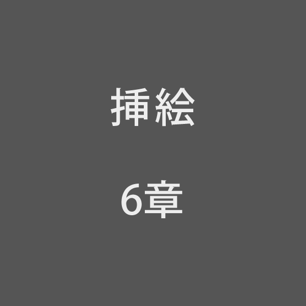

［＃３字下げ］六、銀河ステーション［＃「六、銀河ステーション」は中見出し］

　そしてジョバンニはすぐうしろの天気輪の柱がいつかぼんやりした三角標の形になって、しばらく{蛍|ほたる}のように、ぺかぺか消えたりともったりしているのを見ました。それはだんだんはっきりして、とうとうりんとうごかないようになり、{濃|こ}い{鋼青|こうせい}のそらの野原にたちました。いま新らしく{灼|や}いたばかりの青い{鋼|はがね}の板のような、そらの野原に、まっすぐにすきっと立ったのです。
　するとどこかで、ふしぎな声が、銀河ステーション、銀河ステーションと{云|い}う声がしたと思うといきなり眼の前が、ぱっと明るくなって、まるで億万の{蛍烏賊|ほたるいか}の火を一ぺんに化石させて、そら中に{沈|しず}めたという{工合|ぐあい}、またダイアモンド会社で、ねだんがやすくならないために、わざと{穫|と}れないふりをして、かくして置いた{金剛石|こんごうせき}を、{誰|たれ}かがいきなりひっくりかえして、ばら{撒|ま}いたという風に、眼の前がさあっと明るくなって、ジョバンニは、思わず何べんも眼を{擦|こす}ってしまいました。
　気がついてみると、さっきから、ごとごとごとごと、ジョバンニの乗っている小さな列車が走りつづけていたのでした。ほんとうにジョバンニは、夜の軽便鉄道の、小さな黄いろの電燈のならんだ車室に、窓から外を見ながら{座|すわ}っていたのです。車室の中は、青い{天蚕絨|びろうど}を張った{腰掛|こしか]けが、まるでがら明きで、向うの{鼠|ねずみ}いろのワニスを塗った{壁|かべ}には、{真鍮|しんちゅう}の大きなぼたんが二つ光っているのでした。
　すぐ前の席に、ぬれたようにまっ黒な上着を着た、せいの高い子供が、窓から頭を出して外を見ているのに気が付きました。そしてそのこどもの{肩|かた}のあたりが、どうも見たことのあるような気がして、そう思うと、もうどうしても誰だかわかりたくて、たまらなくなりました。いきなりこっちも窓から顔を出そうとしたとき、俄かにその子供が頭を引っ込めて、こっちを見ました。
　それはカムパネルラだったのです。
　ジョバンニが、カムパネルラ、きみは前からここに居たのと云おうと思ったとき、カムパネルラが
「みんなはねずいぶん走ったけれども{遅|おく}れてしまったよ。ザネリもね、ずいぶん走ったけれども追いつかなかった。」と云いました。
　ジョバンニは、（そうだ、ぼくたちはいま、いっしょにさそって出掛けたのだ。）とおもいながら、
「どこかで待っていようか」と云いました。するとカムパネルラは
「ザネリはもう帰ったよ。お父さんが{迎|むか}いにきたんだ。」
　カムパネルラは、なぜかそう云いながら、少し顔いろが青ざめて、どこか苦しいというふうでした。するとジョバンニも、なんだかどこかに、何か忘れたものがあるというような、おかしな気持ちがしてだまってしまいました。
　ところがカムパネルラは、窓から外をのぞきながら、もうすっかり元気が直って、{勢|いきおい}よく云いました。
「ああしまった。ぼく、{水筒|すいとう}を忘れてきた。スケッチ帳も忘れてきた。けれど構わない。もうじき白鳥の停車場だから。ぼく、白鳥を見るなら、ほんとうにすきだ。川の遠くを飛んでいたって、ぼくはきっと見える。」そして、カムパネルラは、円い板のようになった地図を、しきりにぐるぐるまわして見ていました。まったくその中に、白くあらわされた天の川の左の岸に沿って一条の鉄道線路が、南へ南へとたどって行くのでした。そしてその地図の立派なことは、夜のようにまっ黒な{盤|ばん}の上に、一一の停車場や{三角標|さんかくひょう}、泉水や森が、青や{橙|だいだい}や緑や、うつくしい光でちりばめられてありました。ジョバンニはなんだかその地図をどこかで見たようにおもいました。
「この地図はどこで買ったの。黒曜石でできてるねえ。」
　ジョバンニが云いました。
「銀河ステーションで、もらったんだ。君もらわなかったの。」
「ああ、ぼく銀河ステーションを通ったろうか。いまぼくたちの居るとこ、ここだろう。」
　ジョバンニは、白鳥と書いてある停車場のしるしの、すぐ北を{指|さ}しました。
 
 
 
「そうだ。おや、あの{河原|かわら}は月夜だろうか。」
　そっちを見ますと、青白く光る銀河の岸に、銀いろの空のすすきが、もうまるでいちめん、風にさらさらさらさら、ゆられてうごいて、波を立てているのでした。
「月夜でないよ。銀河だから光るんだよ。」ジョバンニは云いながら、まるではね上りたいくらい{愉快|ゆかい}になって、足をこつこつ鳴らし、窓から顔を出して、高く高く星めぐりの{口笛|くちぶえ}を{吹|ふ}きながら一生けん命延びあがって、その天の川の水を、見きわめようとしましたが、はじめはどうしてもそれが、はっきりしませんでした。けれどもだんだん気をつけて見ると、そのきれいな水は、ガラスよりも水素よりもすきとおって、ときどき{眼|め}の加減か、ちらちら{紫|むらさき}いろのこまかな波をたてたり、{虹|にじ}のようにぎらっと光ったりしながら、声もなくどんどん流れて行き、野原にはあっちにもこっちにも、{燐光|りんこう}の三角標が、うつくしく立っていたのです。遠いものは小さく、近いものは大きく、遠いものは橙や黄いろではっきりし、近いものは青白く少しかすんで、{或|ある}いは三角形、或いは四辺形、あるいは{電|いなずま}や{鎖|くさり}の形、さまざまにならんで、野原いっぱい光っているのでした。ジョバンニは、まるでどきどきして、頭をやけに{振|ふ}りました。するとほんとうに、そのきれいな野原中の青や橙や、いろいろかがやく三角標も、てんでに息をつくように、ちらちらゆれたり{顫|ふる}えたりしました。
「ぼくはもう、すっかり天の野原に来た。」ジョバンニは云いました。
「それにこの汽車石炭をたいていないねえ。」ジョバンニが左手をつき出して窓から前の方を見ながら云いました。
「アルコールか電気だろう。」カムパネルラが云いました。
　ごとごとごとごと、その小さなきれいな汽車は、そらのすすきの風にひるがえる中を、天の川の水や、三角点の青じろい{微光|びこう}の中を、どこまでもどこまでもと、走って行くのでした。
「ああ、りんどうの花が咲いている。もうすっかり秋だねえ。」カムパネルラが、窓の外を指さして云いました。
　線路のへりになったみじかい{芝草|しばくさ}の中に、月長石ででも{刻|きざ}まれたような、すばらしい紫のりんどうの花が咲いていました。
「ぼく、飛び下りて、あいつをとって、また飛び乗ってみせようか。」ジョバンニは胸を{躍|おど}らせて云いました。
「もうだめだ。あんなにうしろへ行ってしまったから。」
　カムパネルラが、そう云ってしまうかしまわないうち、次のりんどうの花が、いっぱいに光って過ぎて行きました。
　と思ったら、もう次から次から、たくさんのきいろな底をもったりんどうの花のコップが、{湧|わ}くように、雨のように、眼の前を通り、三角標の列は、けむるように燃えるように、いよいよ光って立ったのです。
